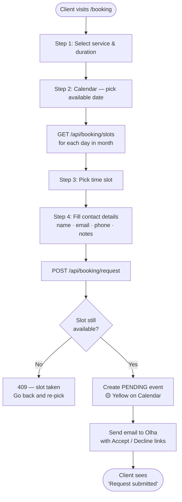
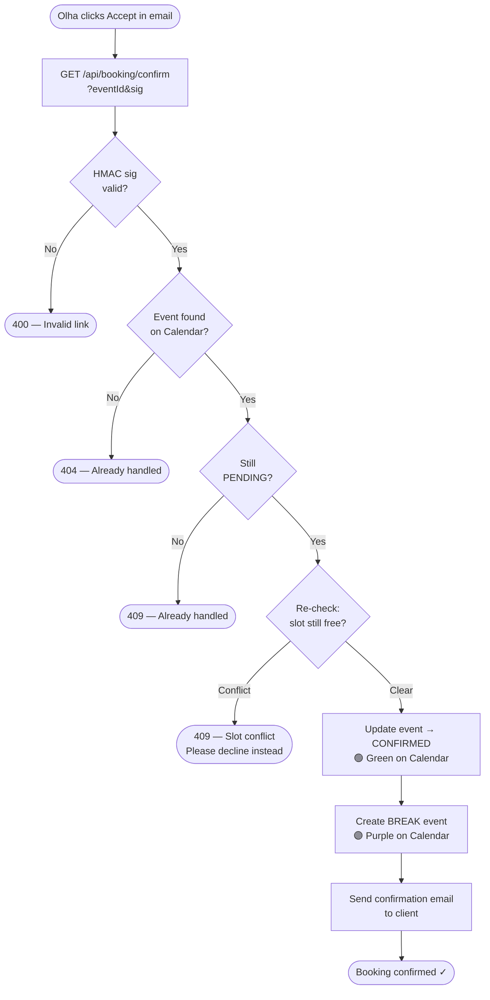
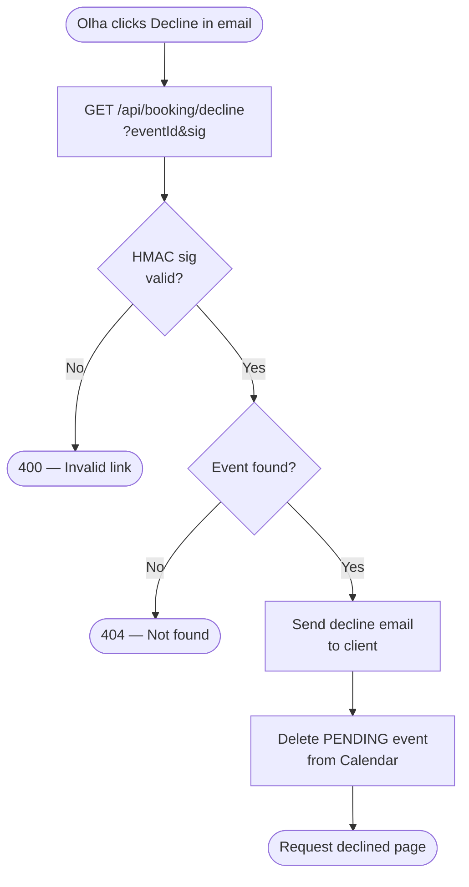
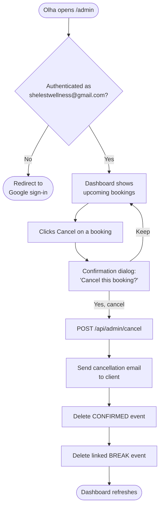
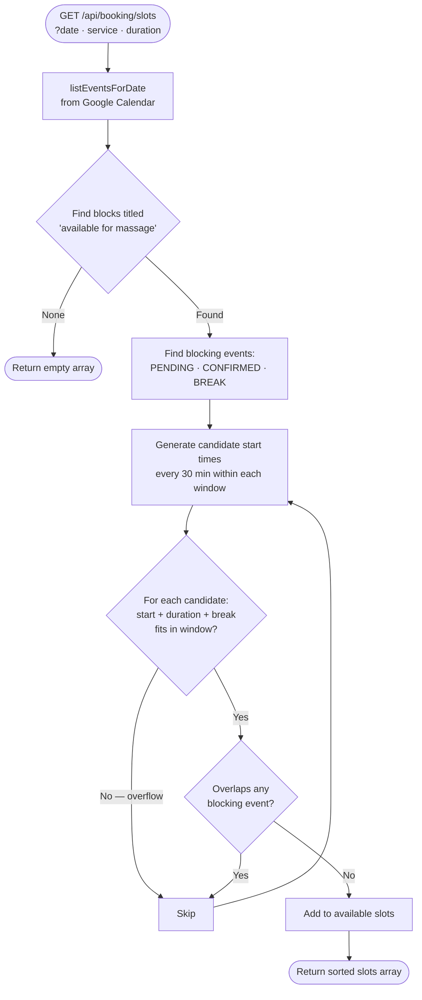

# Booking System — Development Plan

## Context

Custom-built booking system for shelestwellness.ca. No SaaS fees. Google Calendar is the **single source of truth** — all booking state lives in Calendar events. No external database.

Clients submit requests → Olha confirms via email → Google Calendar event created automatically. Payment always in-person (cash or e-transfer).

---

## Tech Stack (additions to existing)

| Addition | Purpose |
|---|---|
| `googleapis` npm package | Google Calendar API (service account) |
| `next-auth` | Google OAuth for /admin (restrict to Olha's email) |
| `jose` or `crypto` (built-in) | HMAC-sign confirm/decline tokens |
| Resend (existing) | All booking emails |

---

## Environment Variables (new)

```
GOOGLE_SERVICE_ACCOUNT_EMAIL=   # service account email
GOOGLE_PRIVATE_KEY=             # service account private key (JSON escaped)
GOOGLE_CALENDAR_ID=             # Olha's calendar ID (or "primary")
BOOKING_TOKEN_SECRET=           # random secret for HMAC signing confirm/decline links
NEXTAUTH_SECRET=                # random secret for NextAuth session
NEXTAUTH_URL=                   # https://www.shelestwellness.ca
```

---

## Config Block (add to `src/lib/config.ts`)

```ts
export const BOOKING = {
  showBookingsService: true,       // false = booking page disabled site-wide
  showBookingsAdmin: true,         // false = /admin route disabled
  breakAfterSession: 30,           // minutes buffer between sessions
  slotInterval: 30,                // minutes — granularity of bookable start times
  cancellationNoticeHours: 12,     // minimum hours notice for client cancellation
  availabilityEventTitle: 'available for massage', // exact title Olha uses in Calendar
  adminEmail: 'shelestwellness@gmail.com',
  calendarColors: {
    pending:   '5',   // Banana (yellow)
    confirmed: '10',  // Basil (dark green)
    break:     '3',   // Grape (purple)
    // "available for massage" blocks: Olha sets gray (Graphite = '8') manually
  },
} as const
```

### Feature Flags

| Flag | Effect when `false` |
|---|---|
| `showBookingsService` | `/[locale]/booking` → 404; "Book Now" nav link hidden; hero CTA falls back to `/contact`; all `/api/booking/*` routes return 503 |
| `showBookingsAdmin` | `/admin` → 404; `/api/admin/*` routes return 503 |

Flags are independent — admin can be off while booking is live, or vice versa.

**Implementation touch points for `showBookingsService: false`:**
- `src/app/[locale]/booking/page.tsx` — `notFound()` if flag is false
- `src/components/Navigation.tsx` — conditionally render "Book Now" link
- `src/components/sections/HeroSection.tsx` — fallback CTA href to `/contact`
- All `/api/booking/*` routes — check flag, return 503 if false
- `src/app/sitemap.ts` — exclude `/booking` if flag is false

**Implementation touch points for `showBookingsAdmin: false`:**
- `src/app/admin/page.tsx` — `notFound()` if flag is false
- All `/api/admin/*` routes — check flag, return 503 if false

**README:** Document both flags in the Configuration section when implemented.

---

## Google Calendar Event Structure

### "available for massage" (set manually by Olha)
- **Title:** `available for massage`
- **Color:** Gray (Graphite — Olha sets this herself)
- **Description:** none needed
- This defines the windows where bookings can be made

### [PENDING] event (created on booking request)
- **Title:** `[PENDING] Deep Tissue Massage 60min — Jane Doe`
- **Color:** Yellow (colorId: `"5"`)
- **Description (JSON):**
```json
{
  "type": "pending",
  "client": {
    "name": "Jane Doe",
    "email": "jane@example.com",
    "phone": "613-555-0123"
  },
  "service": "deepTissue",
  "serviceName": "Deep Tissue Massage",
  "duration": 60,
  "notes": "First time client",
  "requestedAt": "2026-05-07T14:30:00Z"
}
```

### [CONFIRMED] event (created on Accept)
- **Title:** `[CONFIRMED] Deep Tissue Massage 60min — Jane Doe`
- **Color:** Green (colorId: `"10"`)
- **Description:** same JSON as pending, `"type": "confirmed"`, add `"confirmedAt"`

### [BREAK] event (created immediately after confirming)
- **Title:** `[BREAK]`
- **Color:** Purple (colorId: `"3"`)
- **Description:**
```json
{
  "type": "break",
  "linkedEventId": "<confirmed event ID>"
}
```

---

## Services & Durations (from existing `SERVICES` in config.ts)

| Key | Name | Durations |
|---|---|---|
| `therapeutic` | Therapeutic Massage | 60, 90 min |
| `deepTissue` | Deep Tissue Massage | 60, 90 min |
| `relaxation` | Relaxation Massage | 60, 90 min |
| `lymphatic` | Lymphatic Drainage | 60, 90 min |
| `children` | Children's Massage | 30, 60 min |
| `couples` | Couples Massage | 60, 90 min |

---

## Slot Availability Algorithm

```
getAvailableSlots(date, serviceKey, durationMinutes):

  allEvents       = calendarAPI.listEvents(date)
  availWindows    = allEvents where title == BOOKING.availabilityEventTitle
  blockingEvents  = allEvents where title starts with [PENDING], [CONFIRMED], or [BREAK]

  slots = []
  for each window in availWindows:
    t = window.start
    while t + durationMinutes + BOOKING.breakAfterSession <= window.end:
      windowEnd = t + durationMinutes
      if no blockingEvent overlaps [t, windowEnd]:
        slots.push(t)
      t += BOOKING.slotInterval (minutes)

  return slots
```

**Key rule:** the required window = `sessionDuration + breakAfterSession`. Both the session AND the break must fit inside the availability block AND not overlap any existing event.

---

## Flow: Client Books a Session

```
1. Client visits /[locale]/booking

2. Step 1 — Service & Duration
   Select service card → select duration (from SERVICES[key].tiers)

3. Step 2 — Pick a Date
   Month calendar; only dates with ≥1 available slot are clickable
   (lazy-load: query /api/booking/slots?month=YYYY-MM to highlight dates)

4. Step 3 — Pick a Time Slot
   Query /api/booking/slots?date=YYYY-MM-DD&service=x&duration=60
   Show available time buttons

5. Step 4 — Contact Details
   Fields: name, email, phone, notes (optional)
   Submit → POST /api/booking/request

6. System:
   a. Create [PENDING] Calendar event (yellow, JSON description)
   b. Send request email to Olha (see email template below)
   c. Return success page: "Request submitted — we'll confirm shortly"
```

---

## Flow: Olha Accepts Booking

```
1. Olha clicks [Accept] in email
   → GET /api/booking/confirm?eventId=xxx&sig=yyy

2. Verify HMAC signature (reject if invalid)

3. Fetch [PENDING] event from Calendar
   → If not found: "Already handled" page

4. Re-check slot for conflicts
   (another client may have submitted while this was pending)
   → If conflict: "Slot conflict — please decline this request and check other pending bookings"

5. Update event:
   - title: [PENDING] → [CONFIRMED]
   - colorId: '5' → '10'
   - description: update type to "confirmed", add confirmedAt

6. Create [BREAK] event immediately after:
   - start: confirmedEvent.end
   - end: confirmedEvent.end + BOOKING.breakAfterSession
   - colorId: '3' (purple)
   - description: { type: "break", linkedEventId: confirmedEvent.id }

7. Send confirmation email to client (see template below)

8. Redirect Olha → "Booking confirmed ✓" page
```

---

## Flow: Olha Declines Booking

```
1. Olha clicks [Decline] in email
   → GET /api/booking/decline?eventId=xxx&sig=yyy

2. Verify HMAC signature

3. Fetch [PENDING] event → delete it from Calendar

4. Send decline email to client

5. Redirect Olha → "Request declined" page
```

---

## Flow: Olha Cancels (from /admin)

```
1. Olha opens /admin → authenticates via Google OAuth
   (NextAuth restricts to BOOKING.adminEmail)

2. Views upcoming confirmed bookings

3. Clicks [Cancel] → confirmation dialog shows client name + time

4. POST /api/admin/cancel { eventId }

5. Delete [CONFIRMED] event from Calendar
   Delete linked [BREAK] event (via linkedEventId in break description)

6. Send cancellation email to client

7. Dashboard refreshes
```

---

## Flow: Slot Availability Check (double-booking prevention)

- Creating a [PENDING] event immediately blocks the slot for other clients
- Accept re-checks for conflicts before confirming (handles simultaneous submissions)
- [BREAK] events also block time — next available slot is after the break ends
- Race condition window is milliseconds (two simultaneous submissions) → Accept-time conflict check is the safety net

---

## Email Templates

### To Olha — New Booking Request
```
Subject: New Booking Request — Jane Doe, Deep Tissue 60min, May 14

New Booking Request

Client:    Jane Doe
Phone:     613-555-0123
Email:     jane@example.com
Service:   Deep Tissue Massage
Duration:  60 min

Date:      Thursday, May 14, 2026
Session:   2:00 PM – 3:00 PM  (60 min)
Break:     3:00 PM – 3:30 PM  (30 min)

Notes: First time client

──────────────────────────────────
  ✓ ACCEPT THIS BOOKING
  [link to /api/booking/confirm?eventId=x&sig=x]

  ✗ DECLINE THIS BOOKING
  [link to /api/booking/decline?eventId=x&sig=x]
──────────────────────────────────
```

### To Client — Booking Confirmed
```
Subject: Appointment Confirmed — May 14 at 2:00 PM

Your appointment is confirmed!

Service:   Deep Tissue Massage (60 min)
Date:      Thursday, May 14, 2026
Time:      2:00 PM – 3:00 PM

Location:  [BUSINESS.address from config]
Payment:   Cash or Interac e-Transfer, payable at time of appointment

To cancel or reschedule, please contact us at least 12 hours in advance:
Phone: [BUSINESS.phone]
Email: [BUSINESS.email]
```

### To Client — Request Declined
```
Subject: Booking Request — Update

Thank you for reaching out. Unfortunately, the selected time is no longer available.

Please visit our booking page to choose another time:
[SITE.baseUrl]/booking

Or contact us directly:
Phone: [BUSINESS.phone]
Email: [BUSINESS.email]
```

### To Client — Appointment Cancelled
```
Subject: Appointment Cancelled — May 14 at 2:00 PM

Your appointment on Thursday, May 14 at 2:00 PM has been cancelled.

Please contact us to rebook:
Phone: [BUSINESS.phone]
Email: [BUSINESS.email]
```

---

## Admin Dashboard (`/admin`)

- **Auth:** NextAuth.js + Google provider, `signIn` callback restricts to `BOOKING.adminEmail`
- **Not in:** sitemap, navigation, robots.txt disallow
- **Layout:** protected wrapper — redirect to Google sign-in if unauthenticated

### Dashboard Sections

**Future tab (default):**
- Pending requests (yellow badges) — each has [Decline] button
- Confirmed bookings (green badges) — each has [Cancel] button
- Sorted by date ascending

**Past tab:**
- Date picker (defaults to last 30 days)
- Shows Confirmed + Cancelled history
- Read-only

**Booking card shows:**
- Client name, email, phone
- Service name + duration
- Date, start time, end time
- Notes
- Status badge

---

## HMAC Token Signing

```ts
// Sign
const sig = createHmac('sha256', BOOKING_TOKEN_SECRET)
  .update(eventId)
  .digest('hex')

// Verify
const expected = createHmac('sha256', BOOKING_TOKEN_SECRET)
  .update(eventId)
  .digest('hex')
const valid = timingSafeEqual(Buffer.from(sig), Buffer.from(expected))
```

---

## Files to Create

| File | Purpose |
|---|---|
| `src/app/[locale]/booking/page.tsx` | Booking page (server, passes locale to wizard) |
| `src/app/[locale]/booking/BookingWizard.tsx` | Client component — 4-step wizard |
| `src/app/[locale]/booking/BookingCalendar.tsx` | Date picker with availability highlights |
| `src/app/[locale]/booking/TimeSlots.tsx` | Time slot button grid |
| `src/app/admin/page.tsx` | Admin dashboard |
| `src/app/admin/layout.tsx` | Auth protection wrapper |
| `src/app/api/booking/slots/route.ts` | GET available slots |
| `src/app/api/booking/request/route.ts` | POST new booking request |
| `src/app/api/booking/confirm/route.ts` | GET — Olha accepts |
| `src/app/api/booking/decline/route.ts` | GET — Olha declines |
| `src/app/api/admin/cancel/route.ts` | POST — cancel confirmed booking |
| `src/app/api/admin/bookings/route.ts` | GET — list bookings for dashboard |
| `src/app/api/auth/[...nextauth]/route.ts` | NextAuth handler |
| `src/lib/googleCalendar.ts` | Calendar API client (service account auth, CRUD helpers) |
| `src/lib/bookingTokens.ts` | HMAC sign/verify for confirm/decline links |
| `src/lib/bookingSlots.ts` | Slot availability algorithm |
| `src/lib/bookingEmails.ts` | All email templates (uses Resend) |

---

## Files to Modify

| File | Change |
|---|---|
| `src/lib/config.ts` | Add `BOOKING` config block |
| `src/app/sitemap.ts` | Add `/booking`, exclude `/admin` |
| `src/components/Navigation.tsx` | Add "Book Now" CTA link |
| `messages/en.json` | Booking wizard strings |
| `messages/fr.json` | Booking wizard strings (French) |
| `src/middleware.ts` | Protect `/admin/*` routes |
| `README.md` | Add booking system section + flow diagram |
| `TODO.md` | Add/update booking tasks |
| `package.json` | Add `googleapis`, `next-auth` |

---

## SEO

- `/booking` page: full metadata (title, description, OG)
- Add `ReserveAction` to existing `localBusinessJsonLd` (links to /booking)
- `/admin` excluded from sitemap.ts and robots.txt

---

## Navigation

- Add **"Book Now"** to main nav as a CTA-style button (brand green, distinct from regular nav links)
- Hero "Book Your Session" button href → `/booking`
- Services page "Book this session" buttons → `/booking?service=deepTissue` (pre-selects service in wizard)

---

## Open Questions / Setup Steps for Olha

1. **Google Service Account** — create in Google Cloud Console, enable Calendar API, share Olha's calendar with service account email (Editor permission)
2. **Calendar ID** — find in Google Calendar settings → add to `.env`
3. **Color convention** — Olha sets "available for massage" blocks to Gray (Graphite) in her calendar
4. **Admin URL** — `/admin` (Olha bookmarks this; it is not linked anywhere on the site)

---

## Testing Plan

Existing test runner: **Vitest** (`npm test`). Follow same patterns as `src/lib/validation.test.ts`.

### Unit Tests — `src/lib/bookingSlots.test.ts`

Test the slot availability algorithm in isolation. Mock Calendar event data — no real API calls.

| Test case | Expected |
|---|---|
| Single availability block, no bookings | Returns slots at every `slotInterval` within window |
| Slot at end of window — session+break fits exactly | Included |
| Slot at end of window — session+break overflows by 1min | Excluded |
| Existing [CONFIRMED] event blocks its time | Slots overlapping confirmed event excluded |
| Existing [BREAK] event blocks its time | Slots overlapping break excluded |
| Existing [PENDING] event blocks its time | Slots overlapping pending excluded |
| Two availability blocks in one day | Returns slots from both blocks independently |
| No availability blocks | Returns empty array |
| All slots blocked by existing bookings | Returns empty array |
| 30-min children session in 30-min window | Returns exactly 1 slot (no room for break → excluded) |
| 30-min children session in 61-min window (30+30+1min margin) | Returns 1 slot |
| slotInterval=60 — only on-the-hour starts returned | Verified |
| breakAfterSession=0 — no buffer required | Slots pack end-to-end |

### Unit Tests — `src/lib/bookingTokens.test.ts`

| Test case | Expected |
|---|---|
| Sign eventId → verify same eventId | Returns true |
| Sign eventId → verify different eventId | Returns false |
| Tampered sig (one char changed) | Returns false |
| Empty eventId | Does not throw, verifies correctly |
| Different secrets → sig from one fails other | Returns false |

### Unit Tests — `src/lib/bookingEmails.test.ts`

| Test case | Expected |
|---|---|
| Olha email contains session start, end, duration | Present in output |
| Olha email contains break start, end, duration | Present in output |
| Olha email contains client name, phone, email, service | Present in output |
| Olha email contains Accept and Decline URLs with eventId | Present |
| Client confirmation email contains date, time, address | Present |
| Client decline email contains booking page URL | Present |
| Client cancellation email contains phone and email | Present |
| French locale — Olha email still resolves service name to English | Service name is English |

### Integration Tests — `src/app/api/booking/` (Vitest with fetch mock or MSW)

Mock `googleCalendar.ts` module. Test full API route logic without real Calendar calls.

**POST `/api/booking/request`**

| Test case | Expected |
|---|---|
| Valid payload → Calendar event created with correct title/color/description | 200, event created |
| Valid payload → Resend called with correct Olha email | Email sent |
| Missing required field (name) | 400 |
| Invalid email format | 400 |
| Service key not in SERVICES config | 400 |
| Duration not valid for that service | 400 |
| Slot no longer available (Calendar returns conflict) | 409 |

**GET `/api/booking/confirm`**

| Test case | Expected |
|---|---|
| Valid sig, no conflict → event updated to CONFIRMED, break created, client emailed | 200 |
| Invalid HMAC sig | 400 |
| eventId not found on Calendar | 404 |
| Event found but already CONFIRMED (duplicate click) | 409 "already handled" |
| Conflict detected on re-check | 409 "slot conflict" |
| Break event created with correct duration and colorId | Verified |

**GET `/api/booking/decline`**

| Test case | Expected |
|---|---|
| Valid sig → event deleted, client emailed | 200 |
| Invalid sig | 400 |
| eventId not found | 404 |

**POST `/api/admin/cancel`**

| Test case | Expected |
|---|---|
| Authenticated as adminEmail → event + break deleted, client emailed | 200 |
| Not authenticated | 401 |
| Authenticated as non-admin Google account | 403 |
| eventId not found | 404 |

**GET `/api/booking/slots`**

| Test case | Expected |
|---|---|
| Valid date + service + duration | 200, array of ISO time strings |
| Date in the past | 400 |
| Unknown service key | 400 |
| Duration not valid for service | 400 |
| No availability that day | 200, empty array |

### Admin Dashboard Tests — `src/app/admin/` (React Testing Library)

| Test case | Expected |
|---|---|
| Unauthenticated → redirects to Google sign-in | Redirect |
| Authenticated as non-admin → access denied page | 403 page |
| Authenticated as admin → dashboard renders | Renders |
| Future tab shows pending + confirmed sections | Both visible |
| Past tab with date picker filters by selected date | Filtered results |
| Cancel button opens confirmation dialog | Dialog visible |
| Confirm cancel → calls /api/admin/cancel | API called |

### Booking Wizard Tests — `src/app/[locale]/booking/` (React Testing Library)

| Test case | Expected |
|---|---|
| Step 1: select service + duration → Next enabled | Advances to step 2 |
| Step 2: unavailable date not clickable | Cannot select |
| Step 2: available date clickable → advances to step 3 | Time slots shown |
| Step 3: selecting time slot → advances to step 4 | Contact form shown |
| Step 4: submit with all fields → POST /api/booking/request called | Request sent |
| Step 4: submit with missing name → validation error | Error shown |
| Step 4: success → confirmation screen shown | "Request submitted" shown |
| `?service=deepTissue` query param → service pre-selected | Pre-selected |
| French locale → all labels in French | French strings |

### Test File Locations

```
src/lib/bookingSlots.test.ts
src/lib/bookingTokens.test.ts
src/lib/bookingEmails.test.ts
src/app/api/booking/request.test.ts
src/app/api/booking/confirm.test.ts
src/app/api/booking/decline.test.ts
src/app/api/admin/cancel.test.ts
src/app/api/booking/slots.test.ts
src/app/admin/dashboard.test.tsx
src/app/[locale]/booking/BookingWizard.test.tsx
```

---

## Implementation Status

**✅ Complete** — all 10 tasks implemented on the `bookings` branch. 100 tests passing across 13 test files.

| Task | Status | Key files |
|---|---|---|
| BOOKING config block | ✅ | `src/lib/config.ts` |
| Google Calendar API client | ✅ | `src/lib/googleCalendar.ts` |
| Slot availability algorithm | ✅ | `src/lib/bookingSlots.ts` + test |
| HMAC token sign/verify | ✅ | `src/lib/bookingTokens.ts` + test |
| Email templates | ✅ | `src/lib/bookingEmails.ts` + test |
| Booking API routes | ✅ | `src/app/api/booking/` (4 routes + tests) |
| Admin API + NextAuth | ✅ | `src/app/api/admin/` + `src/app/api/auth/` |
| Admin dashboard UI | ✅ | `src/app/admin/` |
| Booking wizard UI | ✅ | `src/app/[locale]/booking/` |
| Nav + sitemap + README | ✅ | Header, sitemap, robots, README |

---

## Next Steps Before Going Live

### 1. Google Service Account (for Calendar API)

1. Go to [Google Cloud Console](https://console.cloud.google.com) → select or create a project
2. Enable **Google Calendar API** (APIs & Services → Library)
3. Create a **Service Account** (IAM & Admin → Service Accounts) → give it any name
4. Create a **key** for the service account → download JSON
5. From the JSON: copy `client_email` → set as `GOOGLE_SERVICE_ACCOUNT_EMAIL`
6. From the JSON: copy `private_key` → set as `GOOGLE_PRIVATE_KEY` (include the full `-----BEGIN...-----END-----` block with literal `\n` sequences)
7. In Google Calendar: open Settings → share Olha's calendar with the service account email → give **Editor** permission
8. In Calendar Settings → copy the Calendar ID (looks like `xxxx@gmail.com` or `xxxx@group.calendar.google.com`) → set as `GOOGLE_CALENDAR_ID`

### 2. Google OAuth (for /admin dashboard)

1. In Google Cloud Console → Credentials → **Create OAuth 2.0 Client ID**
2. Application type: **Web application**
3. Authorized redirect URIs: add `https://www.shelestwellness.ca/api/auth/callback/google`
4. Also add `http://localhost:3000/api/auth/callback/google` for local testing
5. Copy **Client ID** → `GOOGLE_OAUTH_CLIENT_ID`
6. Copy **Client Secret** → `GOOGLE_OAUTH_CLIENT_SECRET`

### 3. Generate random secrets

```bash
# Run these in terminal — each generates a random 32-byte base64 string
openssl rand -base64 32   # → BOOKING_TOKEN_SECRET (must be 32+ chars)
openssl rand -base64 32   # → NEXTAUTH_SECRET
```

### 4. Add all env vars to Vercel

In Vercel project settings → Environment Variables, add:

```
GOOGLE_SERVICE_ACCOUNT_EMAIL
GOOGLE_PRIVATE_KEY
GOOGLE_CALENDAR_ID
BOOKING_TOKEN_SECRET
GOOGLE_OAUTH_CLIENT_ID
GOOGLE_OAUTH_CLIENT_SECRET
NEXTAUTH_SECRET
NEXTAUTH_URL=https://www.shelestwellness.ca
```

### 5. Olha's calendar setup

- Create a test **"available for massage"** block in Google Calendar
- Set the color to **Graphite (gray)**
- Verify the booking page shows that date/time as available

### 6. End-to-end test checklist

- [ ] Create availability block in Calendar (gray)
- [ ] Visit `/booking` → select service → pick date/time → submit request
- [ ] Verify email arrives at `shelestwellness@gmail.com` with Accept/Decline links
- [ ] Verify [PENDING] yellow event appears in Calendar
- [ ] Click Accept → verify confirmation email sent to client, event turns green, purple BREAK event created
- [ ] Test Decline → verify email sent, pending event removed
- [ ] Open `/admin` → sign in with Google → verify dashboard shows booking
- [ ] Test Cancel from dashboard → verify cancellation email + Calendar events removed
- [ ] Submit two requests for same slot simultaneously → second Accept should return slot conflict error

---

## Flow Diagrams

### Flow 1 — Client Books a Session



### Flow 2 — Olha Accepts a Booking



### Flow 3 — Olha Declines a Booking



### Flow 4 — Olha Cancels from Admin Dashboard



### Flow 5 — Slot Availability Calculation


